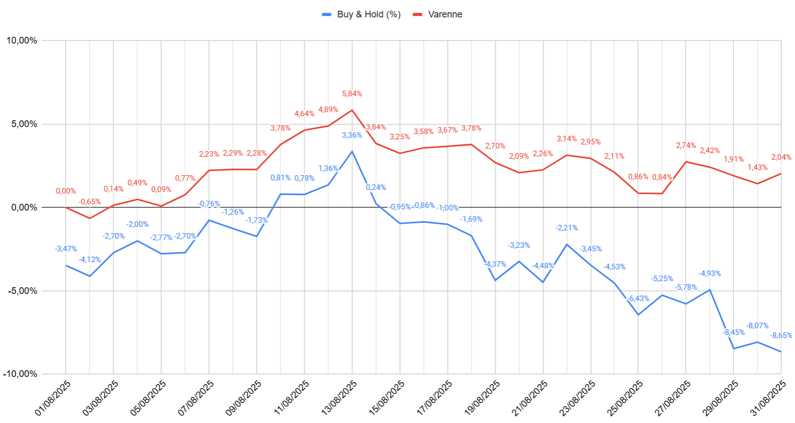
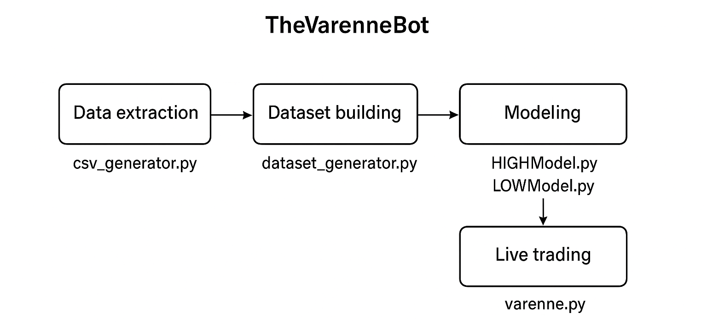

# TheVarenneBot — ML-driven BTCEUR trading bot (Binance)

> End-to-end research → training → simulation → live trading on the BTCEUR pair using the Binance API.

[](#) [](#) [](#)

## Contents

* [Overview](#overview)
* [August 2025 live results](#august-2025-live-results)
* [How it works](#how-it-works)
* [Execution engine: limitations & improvements](#execution-engine-limitations--improvements)
* [Dataset shuffling caveat](#dataset-shuffling-caveat)
* [Temporal Convolutional Networks](#temporal-convolutional-networks)
* [Reproduce the pipeline](#reproduce-the-pipeline)
* [Run live](#run-live)
* [Risk, assumptions & limitations](#risk-assumptions--limitations)
* [Project structure](#project-structure)
* [Roadmap](#roadmap)

---

## Overview

**TheVarenneBot** is a full research–to–production pipeline for short-horizon trading on **BTCEUR**:

* **Data extraction** from Binance (5-minute klines). Robust retry/backoff and rate-limit friendly pagination.
* **Dataset creation**: rolling windows of features/labels suitable for deep learning.
* **Modeling**: two supervised models learn to forecast the next-window **high** and **low** (normalized), which the execution engine translates into actionable orders.
* **Simulation** on a held-out evaluation set.
* **Live trading** via the Binance API.
* **Activity tracking** through a Telegram bot.

---

## August 2025 live results

Period: **2025-08-01 → 2025-08-31** on BTCEUR, compared to a buy-and-hold benchmark.

**Headline:** BTC fell in August; the bot finished **positive** and with materially lower drawdowns — despite **only using long operations**.

| Metric                          |       TheVarenneBot | Buy & Hold (BTCEUR) |
| ------------------------------- | ------------------: | ------------------: |
| Total return (Aug 1→31)         |          **+2.04%** |          **−5.37%** |
| Outperformance (Aug 1→31)       |        **+7.41 pp** |                   — |
| Return vs 31 Jul close (Aug 31) |          **+2.04%** |          **−8.65%** |
| Max drawdown                    |          **−4.72%** |         **−11.62%** |
| Sharpe (annualized, daily)      |            **1.59** |           **−3.26** |
| Sortino (annualized, daily)     |            **2.60** |           **−4.65** |
| Hit rate (days > 0)             |          **51.61%** |          **41.94%** |
| Best / worst day                | **+1.88% / −1.89%** | **+2.13% / −4.13%** |
| Return correlation vs BTC       |            **0.62** |                   — |
| Beta vs BTC (daily)             |            **0.32** |                   — |

**Interpretation.** The bot delivered **positive absolute return in a declining month** and behaved defensively (β≈0.32). Its shallower drawdown and better downside-risk profile (higher Sortino) suggest the model’s signals avoided a chunk of the mid/late-month selloff and limited exposure during spikes in realized volatility.

> 📈 *Equity curves (normalized to 1.0 on 2025-07-31):*  
> 

---

## How it works

**Pipeline at a glance**

1. **Data extraction** (`csv_generator.py`) — pulls 5-minute BTCEUR klines across a date range, with retries and incremental windows to respect API limits. Saves a compact `dataset.csv` with `Open Time`, `Open`, `High`, `Low`.
2. **Data QA** (`errors.py`) — verifies there are **no missing 5-minute intervals**; prints any gaps.
3. **Dataset building** (`dataset_generator.py`) — converts `dataset.csv` into rolling **features**/**labels**:
   * Feature window: **512 bars** (\~42.7 hours).
   * Label window: **256 bars** (\~21.3 hours).
   * Two targets: next-window **max High** and **min Low**, each **z-scored** using the feature window stats.
   * Output: compressed `.npz` files for training/validation and a raw JSON for evaluation.
4. **Modeling** (`HIGHModel.py`, `LOWModel.py`) — train two tensorflow models that predict the normalized next-window **high**/**low** using Temporal Convolutional Networks.
5. **Simulation** (`simulator.py`) — replays the evaluation set to estimate performance, slippage/fees assumptions, and risk. Supports testing **different strategies** beyond the trivial execution engine.
6. **Live trading** (`varenne.py`) — polls for fresh candles, creates signals from model outputs, and routes orders through the Binance API on **BTCEUR**. Trades and diagnostics are logged in real-time to a **Telegram bot**.

> 📊 *End-to-end pipeline schematic:*  
> 

---

## Execution engine: limitations & improvements

The **execution engine in `varenne.py` is deliberately simple**:

* Predictions from the **HIGHModel** and **LOWModel** are compared against the last price.
* If the predicted upside (high − price) exceeds downside (price − low), a **long position** is opened.
* Take-profit = predicted high; stop-loss = predicted low.
* Orders expire after ~21 hours if neither TP nor SL is hit (This is to account for the expiration of the models' forecasts).
* Only **long positions** are used in production (though `simulator.py` supports shorts).

This trivial mapping from forecasts → orders was enough to yield profits in August 2025, but can be improved:

* **Dynamic position sizing** based on forecast confidence.
* **Introduce shorts** in live trading.
* **Smarter exits** (e.g., trailing stops, partial take-profits).
* **Risk overlays** (exposure caps, volatility targeting).
* **Latency reduction** (streaming inference instead of periodic polling).

---

## Dataset shuffling caveat

Both `HIGHModel.py` and `LOWModel.py` use **random shuffling of training samples** to improve generalization.  
While effective in training, this is **not well-suited for simulation**, because:

* Evaluation data loses **time-contiguity**.
* The simulator still tests on **unseen samples**, but not in temporally realistic streaks.

This can make backtests appear smoother than real trading. Future work should use **walk-forward validation** or **rolling train/test splits** to preserve time structure.

---

## Temporal Convolutional Networks

Both models are **Temporal Convolutional Networks (TCNs)** built in TensorFlow:

* Stacked **1D convolutions** with increasing dilation (2, 4, 8) capture both short-term and long-range dependencies.
* Residual depth with pooling compresses information across ~42 hours of history.
* **HIGHModel** predicts the next-window maximum high; **LOWModel** predicts the next-window minimum low.
* Predictions are normalized during training and denormalized at inference.

This architecture balances **expressive power with fast inference**, suitable for live trading.

---

## Reproduce the pipeline

1. **Pull historical data**
   ```bash
   python csv_generator.py
   # produces dataset.csv with 5m candles and columns: Open Time, Open, High, Low
   ```
2. **Sanity-check for gaps**
   ```bash
   python errors.py
   # prints any missing 5m timestamps
   ```
3. **Build ML datasets**
   ```bash
   python dataset_generator.py
   # saves high/low .npz files (train/test) and an evaluation JSON
   ```
4. **Train models**
   ```bash
   python HIGHModel.py
   python LOWModel.py
   ```
5. **Simulate**
   ```bash
   python simulator.py
   # runs evaluation and optional optimization of balance/stake
   ```

---

## Run live

Make sure your models’ weights are saved and discoverable by `varenne.py`.

```bash
python varenne.py
```

Operational tips:
* The bot reports **all trades, open orders, budgets, and diagnostics** via the integrated **Telegram bot**, so you can monitor it remotely.

---

## Risk, assumptions & limitations

* **Fees/slippage.** Simulations should include realistic taker/maker fees and a slippage model; real fills vary by liquidity/time of day.
* **Model drift.** Features are stationary only locally; periodically re-train and re-calibrate.
* **Regime shifts.** Crypto microstructure changes across volatility/liquidity regimes; validate out-of-sample and stress test.
* **Small sample caution.** The August 2025 live window is one month; statistics are noisy. Annualized ratios are reported for comparability, not precision.
* **Key management.** Use read-only keys for backtests and minimal permissions for live trading.

---

## Project structure

```
.
└── src/
  ├── csv_generator.py        # Binance 5m klines → dataset.csv
  ├── errors.py               # Detect missing 5m intervals
  ├── dataset_generator.py    # Rolling features/labels; save .npz & eval JSON
  ├── HIGHModel.py            # Model for next-window High (normalized)
  ├── LOWModel.py             # Model for next-window Low (normalized)
  ├── simulator.py            # Evaluation harness & PnL simulation
  ├── varenne.py              # Live bot using Binance API on BTCEUR
└── docs/
    ├── aug-2025-equity.png  # Equity curves image
    └── pipeline-diagram.png # Pipeline schematic
├── README.md               # ← You are here
```

---

## Roadmap
* Improve **execution logic**: add shorts, trailing stops, adaptive sizing.
* Replace random shuffling with **walk-forward validation**.
* Support **multiple symbols** and automatic **daily re-training**.
